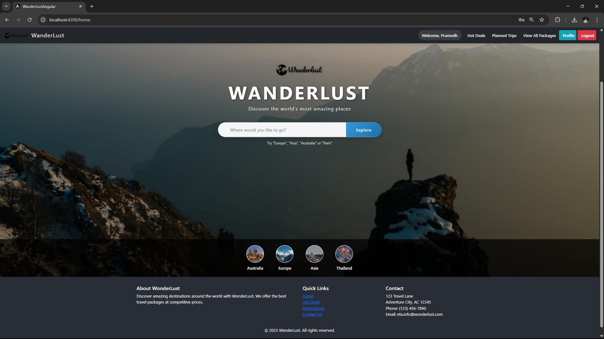
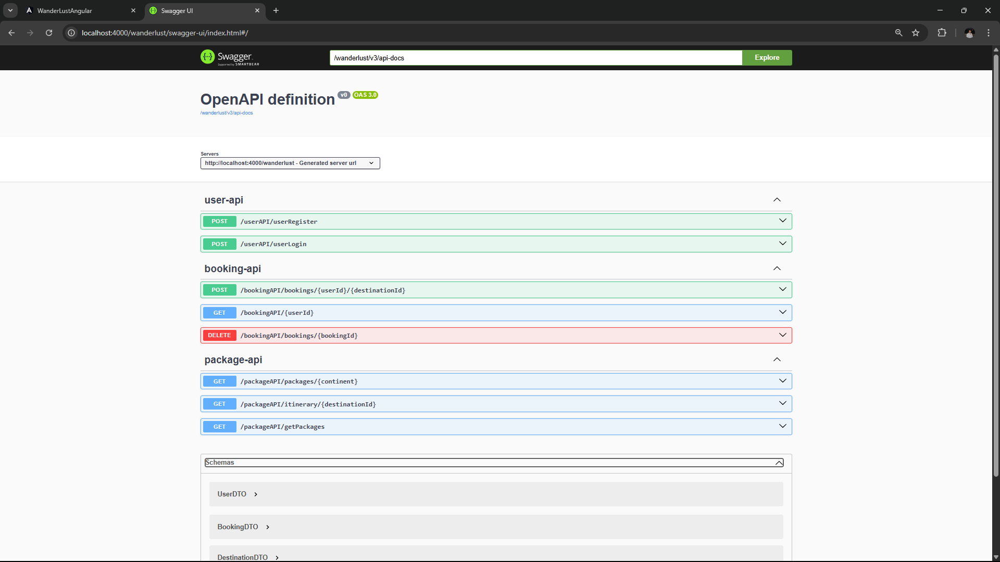

# WanderLust 🧭

## 📑 Table of Contents

1. [Introduction](#introduction)
2. [Technologies Used](#technologies-used)
3. [Screenshots](#screenshots)
4. [Project Setup](#project-setup)
   - [Backend - Spring Boot](#backend---spring-boot)
   - [Frontend - Angular](#frontend---angular)
   - [Database - MySQL Setup](#database---mysql-setup)
5. [Running the Application](#running-the-application)
6. [Running JUnit Tests in Spring Tool Suite](#running-junit-tests-in-spring-tool-suite)
7. [Log4j2 Setup](#log4j2-setup)
8. [Contributing](#contributing)
9. [Author](#author)

---

## 🧾 Introduction

**WanderLust** is a full-stack travel booking application built using **Spring Boot (backend)** and **Angular (frontend)**. It allows users to plan and book travel journeys with ease. The project integrates JUnit for backend testing and provides a seamless user experience from both ends.

The aim of WanderLust is to assist users in choosing, customizing, and booking their perfect travel plan with data-driven suggestions and easy-to-use features.

---

## 🛠 Technologies Used

- **Spring Boot** (v3.2.4)
- **Angular**
- **MySQL**
- **Log4j2**
- **JUnit**
- **ModelMapper**
- **Swagger (Springdoc OpenAPI)**
- **Maven**
- **STS (Spring Tool Suite)**

---

## 🖼️ Screenshots

### Wanderlust Home Page



### Wanderlust Swagger UI



---

## ⚙️ Project Setup

### 📌 Backend - Spring Boot

#### Required Dependencies in `pom.xml`:

- **Spring Boot Starter (core)**

```xml
<dependency>
    <groupId>org.springframework.boot</groupId>
    <artifactId>spring-boot-starter</artifactId>
    <exclusions>
        <exclusion>
            <groupId>org.springframework.boot</groupId>
            <artifactId>spring-boot-starter-logging</artifactId>
        </exclusion>
    </exclusions>
</dependency>
```

- **Spring Boot Log4j2 (logging)**

```xml
<dependency>
    <groupId>org.springframework.boot</groupId>
    <artifactId>spring-boot-starter-log4j2</artifactId>
</dependency>
```

- **Spring Boot Web (REST and MVC)**

```xml
<dependency>
    <groupId>org.springframework.boot</groupId>
    <artifactId>spring-boot-starter-web</artifactId>
</dependency>
```

- **Spring Boot Validation (Bean validation)**

```xml
<dependency>
    <groupId>org.springframework.boot</groupId>
    <artifactId>spring-boot-starter-validation</artifactId>
</dependency>
```

- **Spring Boot JPA (Data Access)**

```xml
<dependency>
    <groupId>org.springframework.boot</groupId>
    <artifactId>spring-boot-starter-data-jpa</artifactId>
</dependency>
```

- **MySQL JDBC Driver**

```xml
<dependency>
    <groupId>mysql</groupId>
    <artifactId>mysql-connector-java</artifactId>
    <version>8.0.32</version>
    <scope>runtime</scope>
</dependency>
```

- **ModelMapper (DTO mapping)**

```xml
<dependency>
    <groupId>org.modelmapper</groupId>
    <artifactId>modelmapper</artifactId>
    <version>3.2.0</version>
</dependency>
```

- **Lombok (Boilerplate code reduction)**

```xml
<dependency>
    <groupId>org.projectlombok</groupId>
    <artifactId>lombok</artifactId>
    <scope>provided</scope>
</dependency>
```

- **Springdoc OpenAPI (Swagger UI)**

```xml
<dependency>
    <groupId>org.springdoc</groupId>
    <artifactId>springdoc-openapi-starter-webmvc-ui</artifactId>
    <version>2.6.0</version>
</dependency>
```

- **Spring Boot DevTools (Live reload)**

```xml
<dependency>
    <groupId>org.springframework.boot</groupId>
    <artifactId>spring-boot-devtools</artifactId>
    <scope>runtime</scope>
    <optional>true</optional>
</dependency>
```

- **Spring Boot Test (Testing with JUnit)**

```xml
<dependency>
    <groupId>org.springframework.boot</groupId>
    <artifactId>spring-boot-starter-test</artifactId>
    <scope>test</scope>
    <exclusions>
        <exclusion>
            <groupId>org.junit.vintage</groupId>
            <artifactId>junit-vintage-engine</artifactId>
        </exclusion>
    </exclusions>
</dependency>
```

---

### 🌐 Frontend - Angular

1. Install [Node.js](https://nodejs.org/) (v16 or above).
2. Install Angular CLI globally:
   ```bash
   npm install -g @angular/cli
   ```
3. Navigate to your Angular project folder:
   ```bash
   cd wanderlust-frontend
   ```
4. Install dependencies:
   ```bash
   npm install
   ```
5. Run the Angular server:
   ```bash
   ng serve --open
   ```

---

### 🗃️ Database - MySQL Setup

1. Install and start MySQL Server on your machine. You can use tools like XAMPP, WAMP, or MySQL Workbench.

2. Create the database in MySQL using terminal or a GUI:

   ```sql
   CREATE DATABASE wanderlust;
   ```

3. Open `tablescripts.sql` file available in the project.

4. Run all the SQL commands in `tablescripts.sql` in your MySQL database to create the necessary tables and insert seed data:

   - Using MySQL CLI:
     ```bash
     mysql -u root -p wanderlust < path/to/tablescripts.sql
     ```
   - Or paste and execute inside MySQL Workbench.

5. Alternatively, if you're unable to run `.sql` file through CLI, you can:
   - Open your terminal or command prompt.
   - Log in to MySQL:
     ```bash
     mysql -u root -p
     ```
   - Use the database:
     ```sql
     USE wanderlust;
     ```
   - Open the `tablescripts.sql` file in any editor, **copy the SQL commands**, and paste them **directly into the MySQL prompt** or **Workbench query window**.
   - Press `Enter` or click **Execute** to run and populate the data manually.

---

## ▶️ Running the Application

**Backend:** Run via STS → Run as Spring Boot App.  
Access Swagger UI: [http://localhost:8080/swagger-ui.html](http://localhost:8080/swagger-ui.html)

**Frontend:** Run `ng serve --open` and open `http://localhost:4200`.

---

## 🧪 Running JUnit Tests

1. Navigate to the `src/test/java` directory in STS.
2. Right-click on the test class or package.
3. Click `Run As` → `JUnit Test`.
4. You can also run tests using Maven:
   ```bash
   mvn test
   ```

---

## 📋 Log4j2 Setup

To enable logging using Log4j2:

### 🔽 Download Required JARs

- Download Log4j2 jars from the official website:  
  [https://logging.apache.org/log4j/2.x/download.html](https://logging.apache.org/log4j/2.x/download.html)

Alternatively, these will be handled by the following dependency:

```xml
<dependency>
    <groupId>org.springframework.boot</groupId>
    <artifactId>spring-boot-starter-log4j2</artifactId>
</dependency>
```

### 📁 Add `log4j2.xml` or `log4j2.properties` in `src/main/resources`

Example `log4j2.xml`:

```xml
<?xml version="1.0" encoding="UTF-8"?>
<Configuration status="WARN">
    <Appenders>
        <Console name="Console" target="SYSTEM_OUT">
            <PatternLayout pattern="%d{HH:mm:ss.SSS} [%t] %-5level %logger{36} - %msg%n" />
        </Console>
    </Appenders>
    <Loggers>
        <Root level="info">
            <AppenderRef ref="Console" />
        </Root>
    </Loggers>
</Configuration>
```

---

## 🤝 Contributing

We welcome contributions to this project! Since this repository is **private**, please follow the steps below:

1. **Request access** to the repository by contacting the maintainer ([@Pramodh9653](https://github.com/PramodhKumar)) or by opening an issue if you see the Issues tab.
2. Once access is granted, **fork** the repository to your own GitHub account.
3. **Clone** your fork locally:
   ```bash
   git clone https://github.com/PramodhKumar/WanderLust.git
   cd WanderLust
   ```
4. **Create** a new feature branch:
   ```bash
   git checkout -b feature/wanderlust
   ```
5. **Make** your changes locally.
6. **Commit** the changes:
   ```bash
   git commit -m "Add: your feature summary"
   ```
7. **Push** the branch to your fork:
   ```bash
   git push origin feature/wanderlust
   ```
8. Open a **Pull Request** from your fork to the main repository.

---

## 👤 Author

**T. Pramodh Kumar**  
Project: **WanderLust**

---

## 🔐 Configuration Example

**application.properties.example**

```
spring.datasource.url=jdbc:mysql://localhost:3306/wanderlust
spring.datasource.username=root
spring.datasource.password=your_password
spring.jpa.hibernate.ddl-auto=update
logging.level.org.springframework=INFO
server.port=8080
```

---

## 📄 License

This project is licensed under the MIT License.

---

## 📁 .gitignore

```
/target/
/node_modules/
/.env
*.log
*.class
*.jar
*.war
.DS_Store
.idea/
*.iml
.vscode/
```
